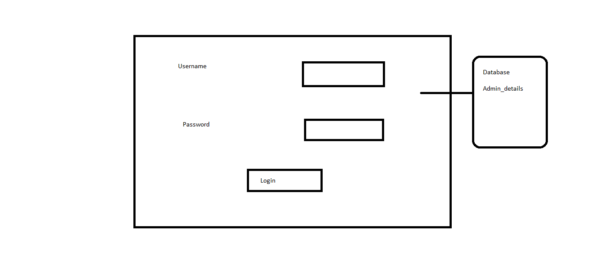
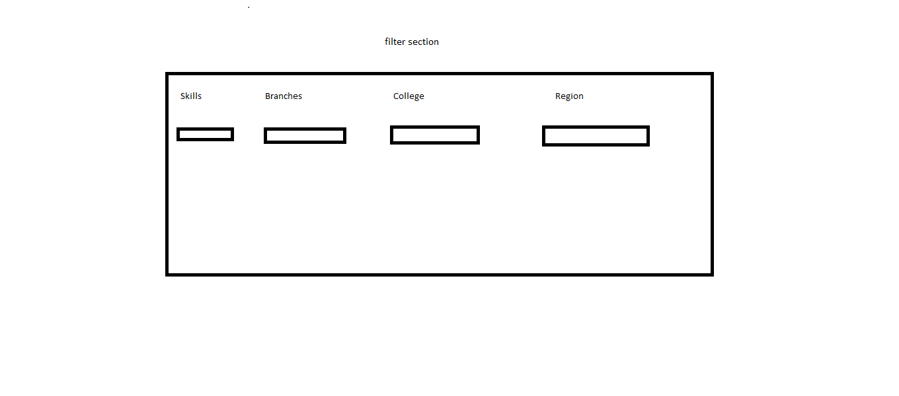
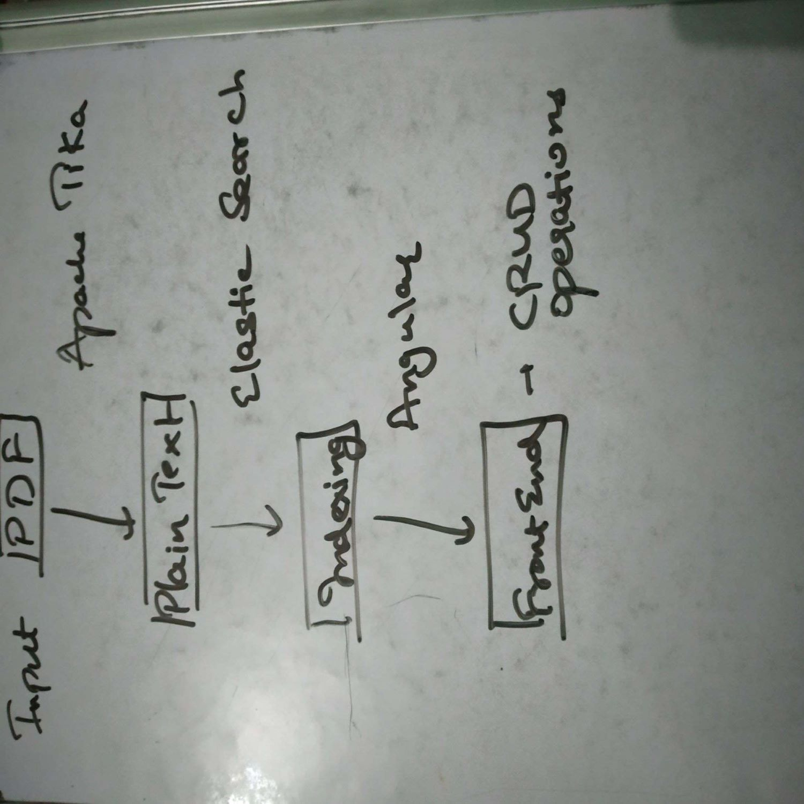

# Resume_filter

# Internship Details 
Create an application that takes pdf of intern files and then provide an interface where 
admin team can do filtering on Skills, branches, colleges, region etc. The user interface should 
list the profile summary of the candidates as result of filtering. A detailed view of candidate profile 
listing key attributes, such as skills, grades. College, and contact details should be displayed,
if admin need details more than the summary.

# Database  
Database name -  exop_db
Tables:
*	Pdf_files to store the pdf uploaded by user
*	Admin_details to store the admin username and password

# HTML pages 
1.	Index.html - user upload the pdf files
2.	Adminlogin.html – admin enter his credentials to login
3.	Admin.html – admin filters the pdf files and get the output

# Assumptions
The pdf files contain fields name, skills, college name, branch, region, contact details.

# Index.html

# Adminlogin.html

# Admin.html

### This page is divided into two sections filter section which is fixed and result section
In filter section the admin applies the various filter.
In result section the summary of the students in list appear. And if the admin click on
any of the user it will open a new tab giving the detailed info of the student. 

## Filter Section

In this all the filters are dropdown list whereas skills are multiselect dropdown list.
The options in the dropdown list are automatically updated as the pdfs are uploaded by user.

## Result Section
It will display the result in list format with a short summary

Like
1.	Xyz name -  short summary
2.	Abc name – short summary

If the admin clicks on any name it will open new web page giving detailed information of student
The detailed information includes – Name, contact details, grades, college, region, photo, skills, branch

## Approach 1

